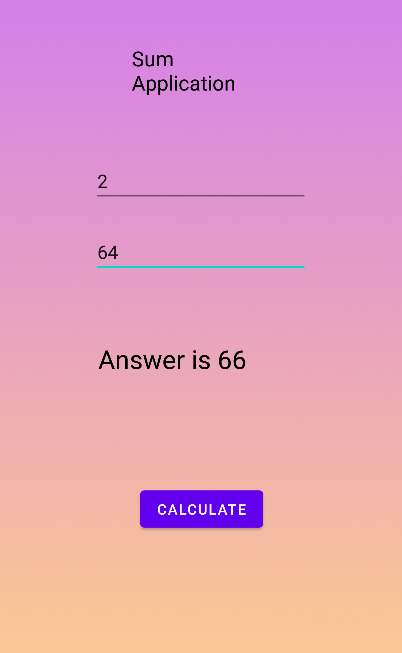

# Sum App

This is a basic Sum app which is created for practice.

## Insights Gained
-Working with Activities and layouts
-How to initiate Multiscreen
-Using Intents and Onclicklistener
-Using Toast
-To apply gradient colour in our app background
-Sending Data across the activities
and much more basic that will help in future project.
## Screenshots

     

)